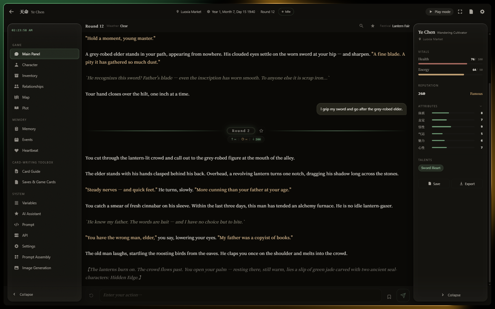
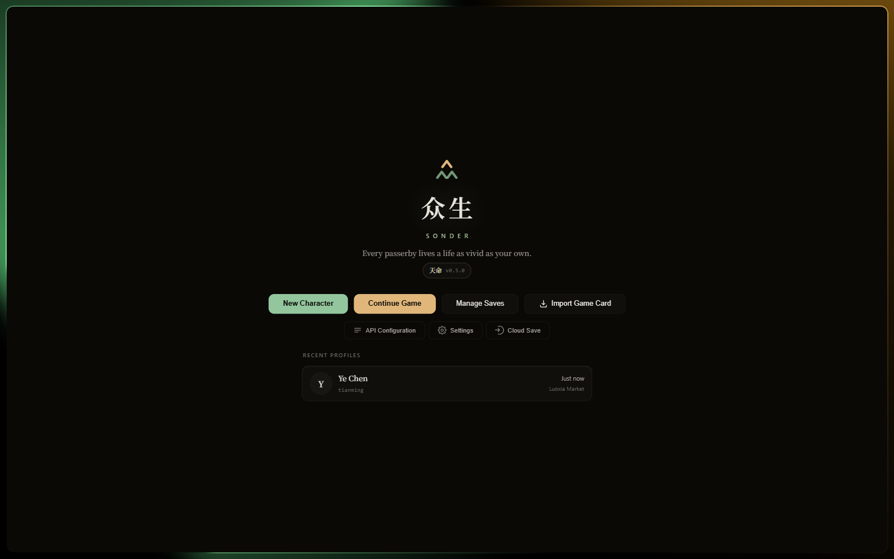
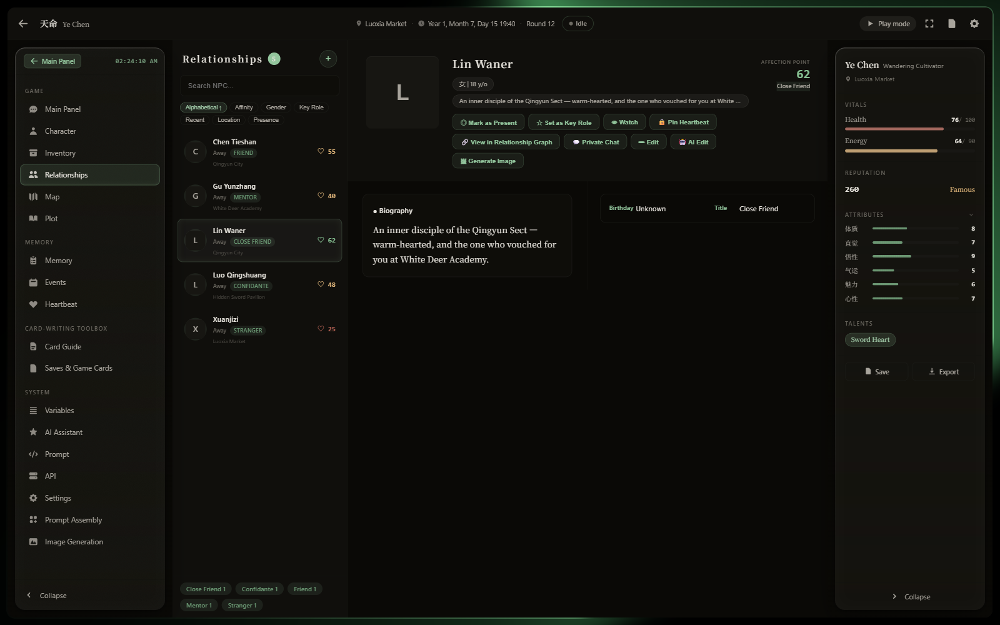
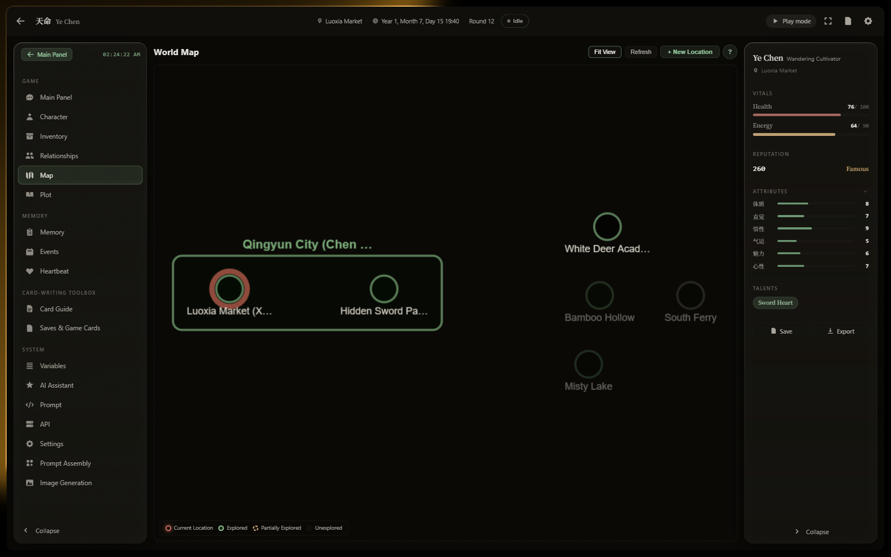
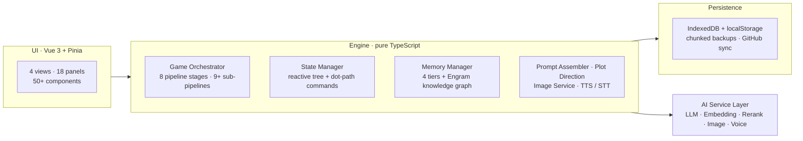

<div align="center">

**English** | [中文](README.zh-CN.md)

<picture>
  <source media="(prefers-color-scheme: dark)" srcset=".github/assets/banner-dark.svg">
  
</picture>

<br>

> ***sonder*** *(n.) — the realization that each random passerby is living a life
> as vivid and complex as your own.*

**Sonder is an open-source AI narrative engine.**
It builds persistent story worlds where every character has a biography, a memory,
and a life of their own — and where nothing you do is ever forgotten.

[](LICENSE)
[](https://vuejs.org/)
[](https://www.typescriptlang.org/)
[](https://vitejs.dev/)
[](https://vitest.dev/)

### [Play Now → michael2221807.github.io/sonder-engine](https://michael2221807.github.io/sonder-engine/)

Runs entirely in your browser. Bring your own API key — nothing is ever sent to our servers.

[Why Sonder](#why-sonder) ·
[Features](#features) ·
[Getting Started](#getting-started) ·
[Architecture](#architecture) ·
[Game Packs](#game-pack-system) ·
[Development](#development)

</div>

---

## Why Sonder

Most "AI storytelling" apps are a chat window with amnesia: the model forgets, the
world resets, characters are cardboard. Sonder is built as an **engine**, not a wrapper —
the same discipline you'd expect from a game engine, applied to LLM-driven narrative:

| | Chat wrapper | **Sonder** |
|---|---|---|
| World state | Buried in chat history | **Reactive state tree**, mutated by typed dot-path commands |
| Memory | Sliding context window | **4-tier progressive memory** + semantic knowledge graph |
| Characters | A name in a prompt | Biography, personality, relationships, private chats, portraits |
| Story control | Hope for the best | **Plot direction system**: arcs, waypoints, progress gauges |
| Your content | Locked in | Game cards — export, share, and import whole worlds |
| Persistence | Local at best | Chunked, SHA-256-verified backups + GitHub cloud sync |

## A Look Inside



<table>
  <tr>
    <td width="33%"></td>
    <td width="33%"></td>
    <td width="33%"></td>
  </tr>
  <tr align="center">
    <td><em>A home that feels like a sanctuary</em></td>
    <td><em>NPCs with biographies and affection</em></td>
    <td><em>A world map that grows as you explore</em></td>
  </tr>
</table>

## Features

**🧠 A world that remembers**
Four memory tiers (short → implicit-mid → mid → long-term) with automatic AI compression,
plus **Engram** — a Graphiti-aligned knowledge graph with entity nodes, fact edges, and
hybrid retrieval (cosine + BM25 + RRF + BFS graph expansion). Mark any input with
`<设定>` and the engine captures it as permanent world canon.

**👥 Characters that live**
NPCs carry biographies, six-dimensional personalities, evolving relationship networks,
AI-generated portraits — and you can pull any of them into a private 1-on-1 conversation
that feeds back into the shared world state.

**🎭 A story with a spine**
An 8-stage round pipeline (context assembly → AI call → response repair → command
execution → post-process, with fail-soft error handling at every stage), streamed
token-by-token with rich inline formatting. Plot arcs, waypoints, and AI-evaluated
progress gauges keep long campaigns coherent.

**🖼️ A world you can see**
Multi-backend image generation — NovelAI, Civitai (with LoRA shelf + trigger-word
dictionary), DALL-E, SD-WebUI, ComfyUI. Character visual anchors keep faces consistent;
scene wallpapers follow the narrative; img2img and AI captioning close the loop.

**🎙️ A world you can hear**
Streaming TTS narration and real-time speech-to-text input (2-pass streaming dictation
with hot-word lexicons for proper nouns), via a local CosyVoice backend.

**🃏 Worlds as cartridges**
The engine is 100% content-agnostic. Everything game-specific lives in a **Game Pack**
(schemas, prompts, presets, creation flow). Export any save as a shareable game card;
import someone else's card and continue their world.

**☁️ Nothing ever lost**
Auto-save every round, full chunked backups with double SHA-256 verification, GitHub
cloud sync with per-profile save slots, multi-device conflict detection, and rollback
to any previous round.

## Getting Started

### Play online (recommended)

Open **[michael2221807.github.io/sonder-engine](https://michael2221807.github.io/sonder-engine/)**:

1. Click **API Configuration** and add at least one LLM API (OpenAI-compatible,
   Anthropic, Ollama, SiliconFlow, …) — assign it to the `main` usage type
2. Click **New Character** and follow the creation wizard
3. **Start Game.** Everything is stored locally in your browser (IndexedDB + localStorage)

### Run locally

```bash
git clone https://github.com/michael2221807/sonder-engine.git
cd sonder-engine
npm install
npm run dev
```

## Architecture



**Non-negotiable design rules:**

- **Engine / content separation** — engine code never contains game-specific content;
  swap the Game Pack, get a different game
- **Single reactive state tree** — the AI mutates the world only through typed
  dot-path commands, never free-form
- **Fail-soft pipeline** — any stage can degrade gracefully without eating your save
- **Persistence is sacred** — every state change is covered by a backup/restore
  round-trip test gate

## Game Pack System

```
packs/{packId}/
├── manifest.json              # Metadata + file references
├── schemas/state-schema.json  # The world's shape
├── creation-flow.json         # Character creation steps
├── prompt-flows/*.json        # Prompt composition configs
├── prompts/*.md               # Prompt content with {{variables}}
├── presets/*.json             # Worlds / origins / talents
└── rules/*.json               # Engine paths, behaviors
```

The bundled pack **天命 (Tianming)** ships 4+4 worlds, a six-attribute creation system,
56 origins, 48 traits, and 77 talents — and is itself just data.

## Supported AI Providers

| Provider | LLM | Embedding | Rerank | Image | Voice |
|----------|:---:|:---------:|:------:|:-----:|:-----:|
| OpenAI / compatible | ✓ | ✓ | — | ✓ | — |
| Anthropic | ✓ | — | — | — | — |
| Ollama | ✓ | ✓ | — | — | — |
| SiliconFlow | ✓ | ✓ | ✓ | — | — |
| NovelAI | — | — | — | ✓ | — |
| Civitai | — | — | — | ✓ | — |
| SD-WebUI / ComfyUI | — | — | — | ✓ | — |
| CosyVoice (local) | — | — | — | — | TTS + STT |
| Custom endpoint | ✓ | ✓ | ✓ | ✓ | — |

## Development

| Command | Purpose |
|---------|---------|
| `npm run dev` | Dev server with HMR (LAN accessible) |
| `npm run build` | Type-check + production build |
| `npm test` | Run the test suite (3100+ tests) |
| `npm run typecheck` | `vue-tsc --noEmit` |

```
src/
├── engine/           # Pure TypeScript engine (zero Vue imports)
│   ├── core/         # StateManager, CommandExecutor, Orchestrator
│   ├── pipeline/     # 8 stages + sub-pipelines
│   ├── memory/       # 4-tier memory + Engram knowledge graph
│   ├── prompt/       # Assembler, Registry, TemplateEngine
│   ├── persistence/  # Save / Profile / Backup managers
│   ├── image/        # Image generation providers
│   ├── tts/ stt/     # Voice in and out
│   └── plot/         # Plot direction system
└── ui/               # Vue 3 views, panels, composables
```

Push to `main` triggers: test → typecheck → build → deploy to GitHub Pages.

## Contributing

Contributions are welcome — please open an issue first to discuss what you'd like
to change.

## License

**GNU AGPL-3.0** — free to use, modify, and distribute; if you deploy a modified
version as a network service, you must publish your source under the same license.
See [LICENSE](LICENSE).

---

<div align="center">

*Formerly known as **AutoGameAgent** — renamed 2026-08. Old repository links redirect automatically.*

Made with persistence and late-night sessions.

</div>
