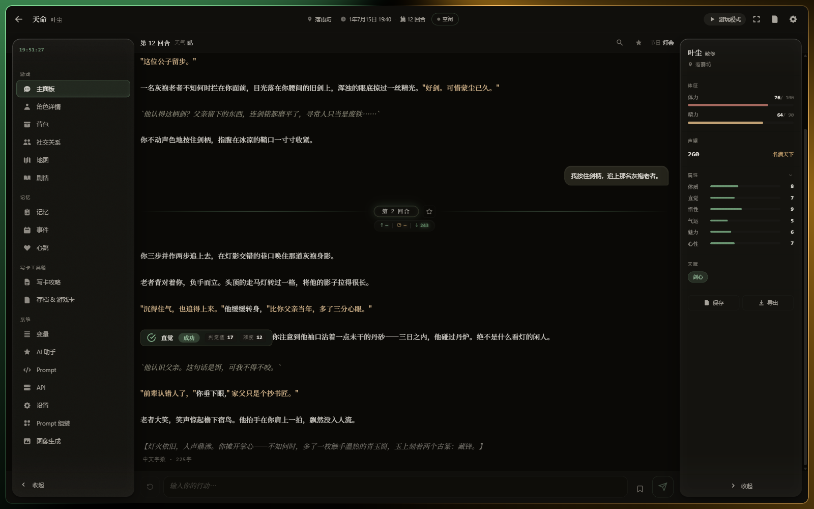
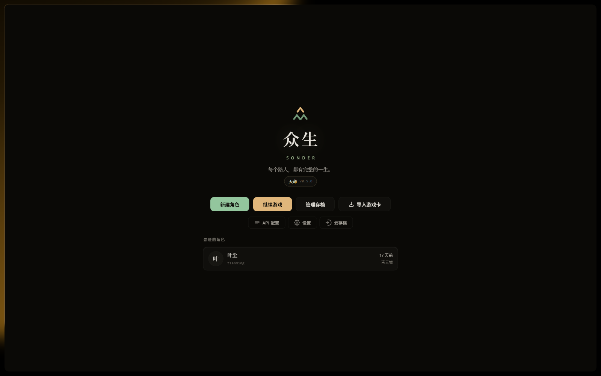
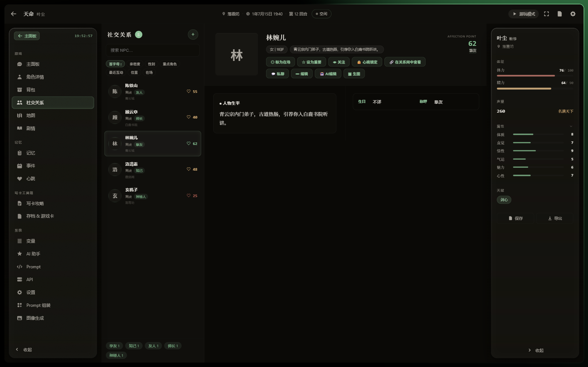
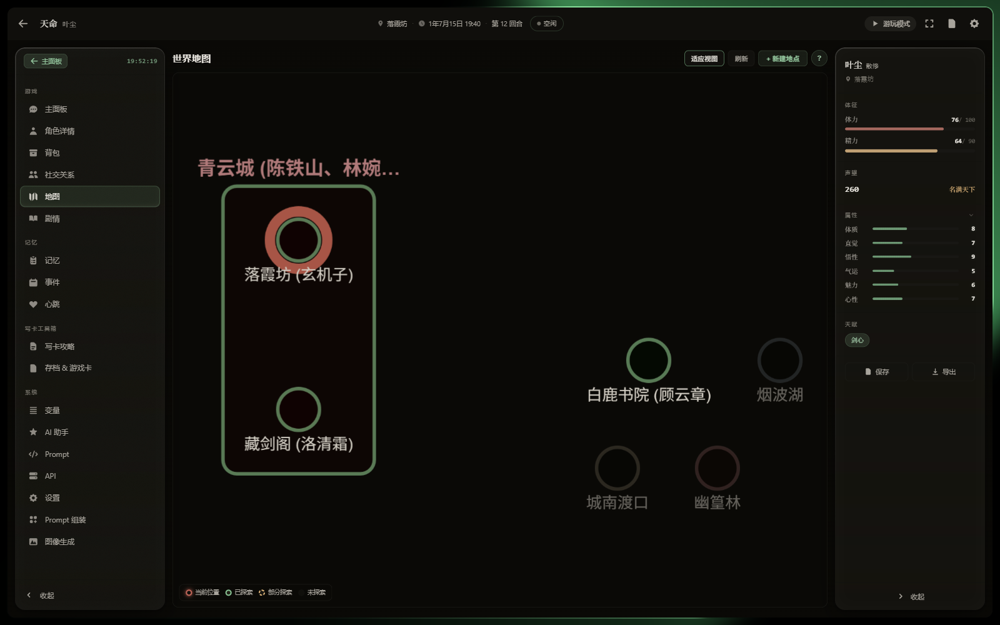
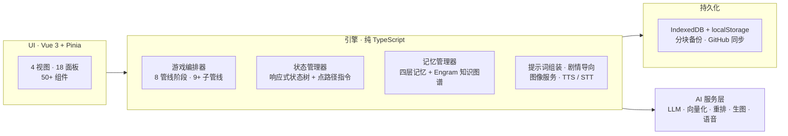

<div align="center">

[English](README.md) | **中文**

<picture>
  <source media="(prefers-color-scheme: dark)" srcset=".github/assets/banner-dark.svg">
  
</picture>

<br>

> ***sonder*** *（生造词）—— 突然意识到，每一个路人都有和你一样鲜活而完整的一生。*

**众生（Sonder）是一个开源 AI 叙事引擎。**
它构建持久存在的故事世界：每个角色都有自己的传记、记忆与生活——
而你做过的一切，永远不会被遗忘。

[](LICENSE)
[](https://vuejs.org/)
[](https://www.typescriptlang.org/)
[](https://vitejs.dev/)
[](https://vitest.dev/)

### [立即开始 → michael2221807.github.io/sonder-engine](https://michael2221807.github.io/sonder-engine/)

完全运行在你的浏览器里。自带 API key 即玩——你的数据永远不会发送到我们的服务器。

[为什么是众生](#为什么是众生) ·
[功能](#功能) ·
[快速上手](#快速上手) ·
[架构](#架构) ·
[游戏包系统](#游戏包系统) ·
[开发](#开发)

</div>

---

## 为什么是众生

大多数"AI 讲故事"应用只是一个患有健忘症的聊天窗口：模型会忘、世界会重置、角色是纸片人。
众生按照**游戏引擎**的工程纪律来构建 LLM 驱动的叙事，而不是做一层聊天套壳：

| | 聊天套壳 | **众生 Sonder** |
|---|---|---|
| 世界状态 | 埋在聊天记录里 | **响应式状态树**，AI 通过类型化的点路径指令修改 |
| 记忆 | 滑动上下文窗口 | **四层递进式记忆** + 语义知识图谱 |
| 角色 | 提示词里的一个名字 | 传记、性格、关系网、私聊、立绘 |
| 剧情控制 | 听天由命 | **剧情导向系统**：故事弧、路标、进度仪表 |
| 你的创作 | 被锁死 | 游戏卡——整个世界可导出、分享、导入 |
| 持久化 | 顶多存在本地 | 分块 SHA-256 双重校验备份 + GitHub 云同步 |

## 界面一瞥



<table>
  <tr>
    <td width="33%"></td>
    <td width="33%"></td>
    <td width="33%"></td>
  </tr>
  <tr align="center">
    <td><em>像庇护所一样的首页</em></td>
    <td><em>有传记与好感的 NPC</em></td>
    <td><em>随探索生长的世界地图</em></td>
  </tr>
</table>

## 功能

**🧠 会记住一切的世界**
四层记忆（短期 → 隐式中期 → 中期 → 长期）自动 AI 压缩，配合 **Engram** 知识图谱
（实体节点 + 事实边，Cosine + BM25 + RRF + 图扩展混合检索）。输入时加上 `<设定>`
标记，引擎自动把它沉淀为永久世界观。

**👥 有完整人生的角色**
NPC 拥有传记、六维性格、持续演化的关系网络、AI 生成的立绘——你可以随时把任何一个
拉进一对一私聊，对话结果回流进共享世界。

**🎭 有骨架的故事**
每回合经过 8 阶段管线（上下文组装 → AI 调用 → 响应修复 → 指令执行 → 后处理，
每一段都有降级兜底），逐字流式输出并实时排版。故事弧、路标与 AI 评估的进度仪表
让长篇战役不散架。

**🖼️ 看得见的世界**
多后端生图——NovelAI、Civitai（LoRA 书架 + 触发词词典）、DALL-E、SD-WebUI、ComfyUI。
角色视觉锚点保持面容一致，场景壁纸跟随叙事，img2img 与 AI 反推标注闭环。

**🎙️ 听得见的世界**
流式 TTS 配音 + 实时语音输入（2-pass 流式听写，支持专有名词热词词典），
基于本地 CosyVoice 后端。

**🃏 世界即卡带**
引擎 100% 内容无关。所有游戏内容都在**游戏包**里（schema、提示词、预设、创角流程）。
任何存档可导出为游戏卡分享；导入别人的卡，继续他们的世界。

**☁️ 永不丢失**
每回合自动存档、分块压缩 + 双层 SHA-256 校验的全量备份、按档案分插槽的 GitHub
云存档、多设备冲突检测、任意回合回滚。

## 快速上手

### 在线游玩（推荐）

打开 **[michael2221807.github.io/sonder-engine](https://michael2221807.github.io/sonder-engine/)**：

1. 点击**API 配置**，添加至少一个 LLM API（OpenAI 兼容、Anthropic、Ollama、SiliconFlow 等），指派给 `main` 用途
2. 点击**新建角色**，跟随创角向导
3. **开始游戏。** 所有数据只存在你的浏览器里（IndexedDB + localStorage）

### 本地运行

```bash
git clone https://github.com/michael2221807/sonder-engine.git
cd sonder-engine
npm install
npm run dev
```

## 架构



**不可动摇的设计铁律：**

- **引擎 / 内容分离** —— 引擎代码永不包含具体游戏内容；换游戏包，就是换一个游戏
- **单一响应式状态树** —— AI 只能通过类型化点路径指令改世界，绝无自由发挥
- **降级式管线** —— 任何阶段都能优雅降级，绝不吃掉你的存档
- **存档神圣不可侵犯** —— 每个状态变更都有备份/恢复往返测试门守着

## 游戏包系统

```
packs/{packId}/
├── manifest.json              # 元数据 + 文件引用
├── schemas/state-schema.json  # 世界的形状
├── creation-flow.json         # 创角步骤
├── prompt-flows/*.json        # 提示词组装配置
├── prompts/*.md               # 带 {{变量}} 的提示词内容
├── presets/*.json             # 世界 / 出身 / 天赋数据
└── rules/*.json               # 引擎路径与行为
```

内置游戏包**《天命》**提供 4+4 世界、六维创角、56 出身、48 特质、77 天赋——
而它本身只是数据。

## 支持的 AI 服务商

| 服务商 | LLM | 向量化 | 重排 | 生图 | 语音 |
|--------|:---:|:------:|:----:|:----:|:----:|
| OpenAI / 兼容 | ✓ | ✓ | — | ✓ | — |
| Anthropic | ✓ | — | — | — | — |
| Ollama | ✓ | ✓ | — | — | — |
| SiliconFlow | ✓ | ✓ | ✓ | — | — |
| NovelAI | — | — | — | ✓ | — |
| Civitai | — | — | — | ✓ | — |
| SD-WebUI / ComfyUI | — | — | — | ✓ | — |
| CosyVoice（本地） | — | — | — | — | TTS + STT |
| 自定义端点 | ✓ | ✓ | ✓ | ✓ | — |

## 开发

| 命令 | 用途 |
|------|------|
| `npm run dev` | 开发服务器（支持局域网访问） |
| `npm run build` | 类型检查 + 生产构建 |
| `npm test` | 运行测试套件（3100+ 测试） |
| `npm run typecheck` | `vue-tsc --noEmit` |

```
src/
├── engine/           # 纯 TypeScript 引擎（零 Vue 依赖）
│   ├── core/         # 状态管理器、指令执行器、编排器
│   ├── pipeline/     # 8 阶段 + 子管线
│   ├── memory/       # 四层记忆 + Engram 知识图谱
│   ├── prompt/       # 组装器、注册表、模板引擎
│   ├── persistence/  # 存档 / 档案 / 备份管理
│   ├── image/        # 生图 provider
│   ├── tts/ stt/     # 语音输入与输出
│   └── plot/         # 剧情导向系统
└── ui/               # Vue 3 视图、面板、composables
```

推送到 `main` 自动触发：测试 → 类型检查 → 构建 → 部署到 GitHub Pages。

## 贡献

欢迎贡献——请先开 issue 讨论你想改的内容。

## 许可证

**GNU AGPL-3.0** —— 自由使用、修改、分发；若你把修改后的版本部署为网络服务，
必须以同样的许可证公开源码。详见 [LICENSE](LICENSE)。

---

<div align="center">

*曾用名 **AutoGameAgent**，2026 年 8 月更名。旧仓库链接会自动重定向。*

以执着与无数个深夜写成。

</div>
